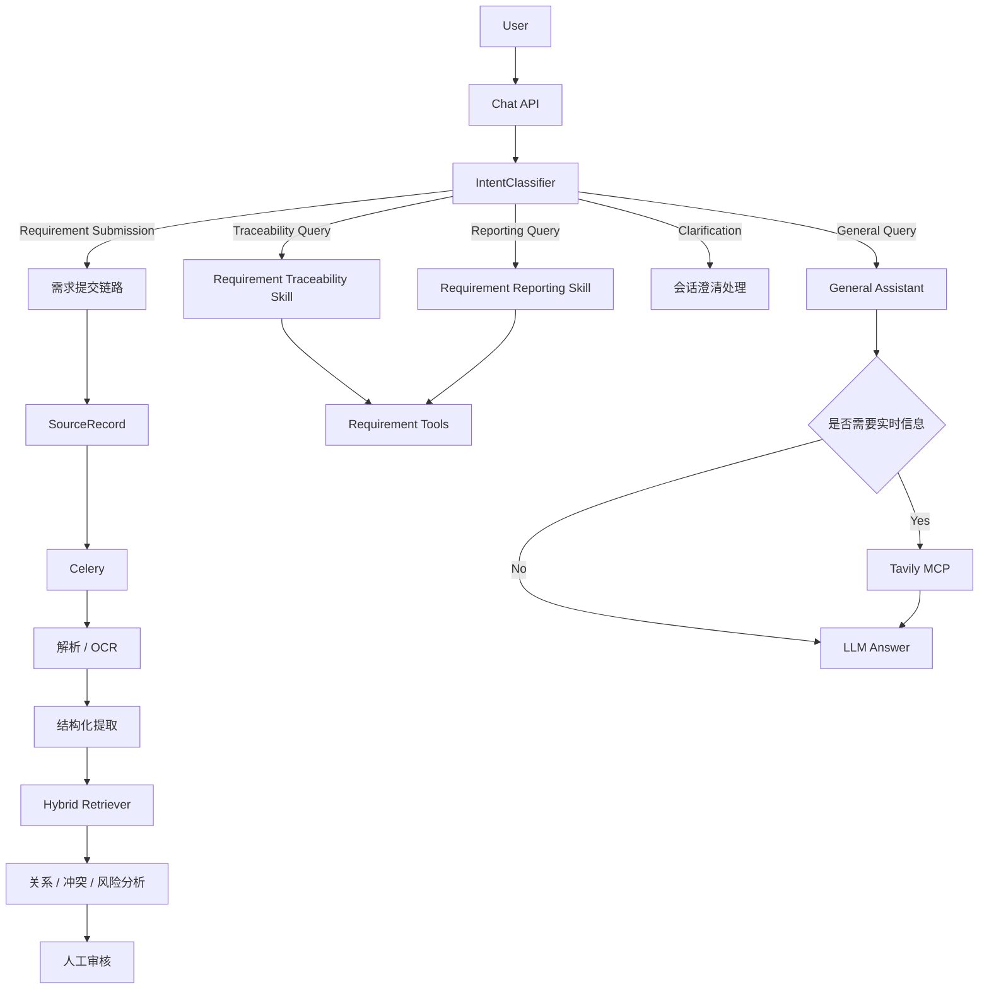

# Requirement Agent

一个面向真实产品研发流程的**多渠道需求管理 Agent**。

项目不是单纯的聊天机器人，而是一套以 **LLM + Agent + RAG + 人工审核 + 版本追溯** 为核心的需求管理系统。它可以接收网页文本、PDF、Word、截图和飞书消息等非结构化输入，自动完成文档解析、需求结构化提取、历史需求检索、重复/关联/冲突分析、风险识别、人工审核和正式版本沉淀。

同时，系统提供统一对话入口，通过 LLM 意图分类器区分“需求提交、需求追溯、需求报告、需求澄清和通用问答”。与需求管理无关的问题会进入 General Assistant，并可按需通过 **Tavily MCP** 获取实时网页信息，不会污染正式需求库和 RAG 数据。

---

## 1. 核心能力

### 多渠道需求接入

支持多种需求来源：

- Web 对话文本
- PDF
- DOCX
- PNG / JPEG 截图
- 飞书消息、图片和文件

附件统一保存到 MinIO，来源、解析状态和处理记录保存到 PostgreSQL。

### 文档解析与 OCR

系统根据附件类型执行不同解析流程：

- PDF：PyMuPDF
- Word：python-docx
- 图片：PaddleOCR
- 文本：直接进入需求分析链路

解析完成后将正文写入来源记录，并异步进入后续 AI 分析。

### LLM 结构化需求提取

需求文本经过 OpenAI-compatible LLM 处理后，提取为结构化字段，包括：

- 需求摘要
- 需求描述
- 功能模块
- 验收标准
- 待确认问题
- 关键实体

模型输出使用 Pydantic Structured Output 校验，避免自由文本直接进入业务数据。

### 混合 RAG 检索

系统使用三路检索召回历史正式需求：

```text
Keyword Retrieval
        +
Vector Retrieval
        +
Business Field Retrieval
        ↓
Hybrid Retriever
```

默认权重：

```text
0.4 × keyword_score
+ 0.4 × vector_score
+ 0.2 × business_field_score
```

其中：

- PostgreSQL GIN：全文关键词检索
- pgvector HNSW：向量相似度检索
- 业务字段：模块和结构化字段匹配

只检索已经审核并进入正式版本的需求投影。

### 需求关系与冲突分析

在检索候选需求后，Agent 会结合当前输入分析：

- duplicate：重复需求
- related：相关需求
- conflict：冲突需求
- modify / replace：修改或替代关系
- dependency：依赖关系

分析结果不会直接修改正式需求，而是生成审核材料。

### 人工审核与版本管理

AI 负责分析，**人负责最终决策**。

审核人员可以：

- 创建新需求
- 合并到已有需求
- 修改标准化结果
- 新增功能
- 修改功能
- 删除功能
- 恢复功能
- 退回
- 驳回
- 重新分析

正式需求采用版本快照管理：

```text
Requirement
    ↓
RequirementVersion
    ↓
RequirementFeature
    ↓
FeatureLineage
```

每次变更都保留来源和版本信息，实现完整需求追溯。

---

## 2. 对话 Agent

系统使用统一聊天入口，不同问题由 IntentClassifier 自动路由。

### 意图分类

当前支持五类意图：

```text
REQUIREMENT_SUBMISSION
TRACEABILITY_QUERY
REPORTING_QUERY
CLARIFICATION
GENERAL_QUERY
```

示例：

```text
“新增停车位置管理功能”
→ REQUIREMENT_SUBMISSION

“之前有没有停车位置相关需求？”
→ TRACEABILITY_QUERY

“总结一下当前车辆相关需求”
→ REPORTING_QUERY

“需要支持单独关闭提醒”
→ CLARIFICATION

“PostgreSQL GIN 是什么？”
→ GENERAL_QUERY
```

IntentClassifier 使用：

```text
LLM
+
Pydantic Structured Output
+
最近少量会话上下文
```

分类结果结构：

```python
class IntentClassification(BaseModel):
    intent: ConversationIntent
    confidence: float
    requires_web_search: bool
```

LLM 分类失败时会自动降级到关键词规则，避免聊天链路不可用。

### 路由流程



---

## 3. Skill 与 Function Calling

Agent 不直接拥有全部工具，而是由 Skill 控制工具白名单。

### Requirement Traceability

用于查询：

- 历史需求
- 需求详情
- 来源记录
- 会话摘要

工具包括：

```text
search_requirements
get_requirement_detail
get_source_detail
get_conversation_summary
```

### Requirement Reporting

用于生成需求报告和统计。

主要工具：

```text
get_requirement_report_snapshot
get_conversation_summary
get_requirement_detail
```

### General Assistant

处理与需求管理无关的普通问题。

允许工具：

```text
tavily_search
tavily_extract
```

Agent Tool Calling 最多执行 3 轮，并对工具参数进行 Pydantic 校验、超时控制和异常降级。

---

## 4. Tavily MCP 通用联网能力

General Assistant 在问题涉及以下内容时可自动使用 Tavily：

- 最新信息
- 新闻
- 实时数据
- 当前版本
- 指定网页内容

稳定知识默认由 LLM 直接回答，不强制联网。

调用链：

```text
GENERAL_QUERY
    ↓
General Assistant
    ↓
LLM Tool Calling
    ↓
Tavily MCP
    ↓
tavily_search / tavily_extract
    ↓
Tool Result
    ↓
LLM Final Answer
```

Tavily 使用 Hosted MCP Server，而不是直接调用 Tavily HTTP API。

配置：

```env
TAVILY_MCP_ENABLED=true
TAVILY_MCP_URL=https://mcp.tavily.com/mcp/
TAVILY_API_KEY=your-tavily-api-key
TAVILY_MCP_TIMEOUT_SECONDS=60
```

联网返回的 URL 会保存为消息引用，前端可直接查看来源。

通用问答只保存为 `ConversationMessage`，不会创建：

```text
SourceRecord
Requirement
RequirementEmbedding
ReviewTask
```

因此不会污染正式需求库。

---

## 5. 会话记忆

系统通过：

```text
RequirementConversation
ConversationMessage
```

保存多轮会话。

上下文由两部分组成：

```text
长期摘要
+
最近消息
```

历史消息超过上下文窗口后，会压缩进入 Conversation Summary；近期消息继续作为短期上下文提供给 Agent。

这样既能保持多轮理解能力，又能限制 Prompt 长度。

例如：

```text
User:
LangGraph 是什么？

Assistant:
...

User:
那它和 LangChain 有什么区别？
```

第二轮仍能理解“它”指 LangGraph。

需求会话中的历史上下文同样可以帮助模型理解后续补充、修改和澄清。

---

## 6. 异步任务

耗时任务通过 Celery + Redis 异步执行。

主要流程包括：

```text
parse_source_attachments
        ↓
analyze_source
        ↓
index_requirement_version
        ↓
compact_conversation
```

典型需求处理：

```text
received
   ↓
parsing
   ↓
parsed
   ↓
extracting
   ↓
retrieving
   ↓
analyzing
   ↓
pending_review
```

附件解析失败时进入失败状态，并支持任务重试。

---

## 7. 技术栈

### Backend

- Python 3.12
- FastAPI
- SQLAlchemy Async
- Pydantic
- LangGraph
- Celery
- Redis
- Alembic

### AI / Agent

- OpenAI-compatible Chat Model
- OpenAI-compatible Embedding
- Structured Output
- Function Calling
- Skill-based Tool Registry
- Tavily MCP
- Hybrid RAG

### Storage

- PostgreSQL 16
- pgvector
- PostgreSQL GIN
- MinIO

### Parser

- PyMuPDF
- python-docx
- PaddleOCR
- PaddlePaddle

### Frontend

- React
- TypeScript
- Vite
- Ant Design

### Infrastructure

- Docker
- Docker Compose

---

## 8. 项目结构

```text
requirement_agent/
├── apps/
│   ├── api/                    # FastAPI 服务
│   ├── web/                    # React 前端
│   └── worker/                 # Celery Worker
│
├── src/requirement_agent/
│   ├── ai/
│   │   ├── llm/                # LLM Adapter
│   │   ├── retrieval/          # Hybrid Retriever
│   │   ├── tools/              # Function Calling Tools
│   │   └── skills.py           # Agent Skill Registry
│   │
│   ├── application/
│   │   ├── conversations/      # 会话、意图分类与上下文
│   │   ├── chat_agent.py       # Agent Tool Loop
│   │   └── general_assistant.py
│   │
│   ├── infrastructure/
│   │   ├── database/
│   │   └── tavily_mcp.py       # Tavily MCP Client
│   │
│   └── shared/
│       └── config.py
│
├── migrations/                 # Alembic 数据库迁移
├── tests/                      # 单元测试 / 集成测试 / RAG 评测
├── docker/
├── docker-compose.yml
├── pyproject.toml
├── .env.example
└── README.md
```

---

## 9. 快速启动

### 环境要求

推荐：

```text
Docker 24+
Docker Compose v2
```

本地开发：

```text
Python 3.12
Node.js 22
```

### 1. 克隆项目

```bash
git clone https://github.com/W0226xy/requirement_agent.git
cd requirement_agent
```

### 2. 创建配置

```bash
cp .env.example .env
```

至少配置：

```env
LLM_BASE_URL=
LLM_API_KEY=
LLM_MODEL=

EMBEDDING_BASE_URL=
EMBEDDING_API_KEY=
EMBEDDING_MODEL=
EMBEDDING_DIMENSION=1024
```

如需联网问答：

```env
TAVILY_MCP_ENABLED=true
TAVILY_MCP_URL=https://mcp.tavily.com/mcp/
TAVILY_API_KEY=
TAVILY_MCP_TIMEOUT_SECONDS=60
```

### 3. 构建并启动

```bash
docker compose build
docker compose up -d
```

### 4. 数据库迁移

```bash
docker compose exec api alembic upgrade head
```

### 5. 查看运行状态

```bash
docker compose ps
```

日志：

```bash
docker compose logs -f api
docker compose logs -f worker
```

---

## 10. 服务地址

启动成功后：

| 服务 | 地址 |
|---|---|
| Web 管理后台 | http://localhost:5173 |
| FastAPI OpenAPI | http://localhost:8000/docs |
| API Live Check | http://localhost:8000/health/live |
| API Ready Check | http://localhost:8000/health/ready |
| MinIO Console | http://localhost:9001 |

---

## 11. Web 管理后台

主要页面：

```text
/chat
/requirements
/requirements/{id}
/reviews
/reviews/{id}
/sources
/sources/{id}
/search
/analysis
/connectors
```

其中 `/chat` 是统一对话入口，可以同时处理：

- 正式需求提交
- 需求追溯
- 需求报告
- 需求澄清
- 普通知识问答
- 实时联网搜索

---

## 12. 飞书接入

配置：

```env
FEISHU_APP_ID=
FEISHU_APP_SECRET=
FEISHU_VERIFICATION_TOKEN=
FEISHU_ENCRYPT_KEY=
```

事件回调：

```text
POST /api/v1/connectors/feishu/events
```

飞书消息会转换为统一 SourceRecord，再进入 Celery 需求处理链路。

支持：

- 文本
- 图片
- 文件

---

## 13. RAG 离线评测

项目提供固定人工标注数据集：

```text
tests/fixtures/rag_eval_cases.jsonl
```

可执行：

```bash
python -m requirement_agent.evaluation.rag \
  --dataset tests/fixtures/rag_eval_cases.jsonl \
  --ks 1 3 5 10 \
  --output reports/rag_evaluation.json
```

用于比较：

```text
Keyword Only
Vector Only
Hybrid Retrieval
```

指标采用 Recall@K。

---

## 14. 测试与代码质量

运行测试：

```bash
docker compose run --rm api pytest -p no:cacheprovider
```

Ruff：

```bash
docker compose run --rm api ruff check .
```

Mypy：

```bash
docker compose run --rm api mypy
```

前端：

```bash
npm --prefix apps/web install
npm --prefix apps/web run lint
npm --prefix apps/web run build
```

---

## 15. Tavily MCP 排查

确认 Worker 已安装 MCP SDK：

```bash
docker compose exec -T worker python -c "import mcp; print('mcp installed')"
```

确认配置：

```bash
docker compose exec -T worker python - <<'PY'
from requirement_agent.shared.config import get_settings

s = get_settings()

print("enabled =", s.tavily_mcp_enabled)
print("url =", s.tavily_mcp_url)
print("key_configured =", bool(s.tavily_api_key.get_secret_value()))
print("timeout =", s.tavily_mcp_timeout_seconds)
PY
```

当前 Tavily MCP Client 会在真正调用前执行：

```text
connect
→ initialize
→ list_tools
→ call_tool
```

并记录阶段化错误日志，便于定位 MCP 连接、鉴权、工具发现、参数或超时问题。

---

## 16. 数据安全与约束

项目对关键业务数据采用“AI 建议 + 人工审核”的方式：

- AI 不直接创建正式需求版本
- Tool 使用 Skill 白名单限制
- Function Calling 参数通过 Pydantic 校验
- API Key 不进入源码
- Tavily Key 使用 Bearer Header
- 原始输入、版本和来源链路持久化
- 正式需求修改通过版本快照完成
- Agent Tool Call 可记录审计日志
- 通用联网问答与正式需求数据隔离

---

## 17. 项目特点

与普通 RAG Demo 不同，本项目重点解决的是一个完整的需求生命周期：

```text
多渠道输入
   ↓
解析 / OCR
   ↓
结构化需求提取
   ↓
RAG 历史需求召回
   ↓
重复 / 关联 / 冲突分析
   ↓
风险与变更建议
   ↓
人工审核
   ↓
正式需求版本
   ↓
Feature Lineage
   ↓
后续追溯 / 报告 / 对话查询
```

同时通过：

```text
IntentClassifier
+
Skill
+
Function Calling
+
MCP
+
Conversation Memory
```

将系统从单一需求分析流程扩展为具备路由、工具调用、记忆和联网能力的 Agent。

---

## License

本项目当前仓库未声明独立 License 文件；如需公开分发或商业使用，请先补充明确的许可证声明。
